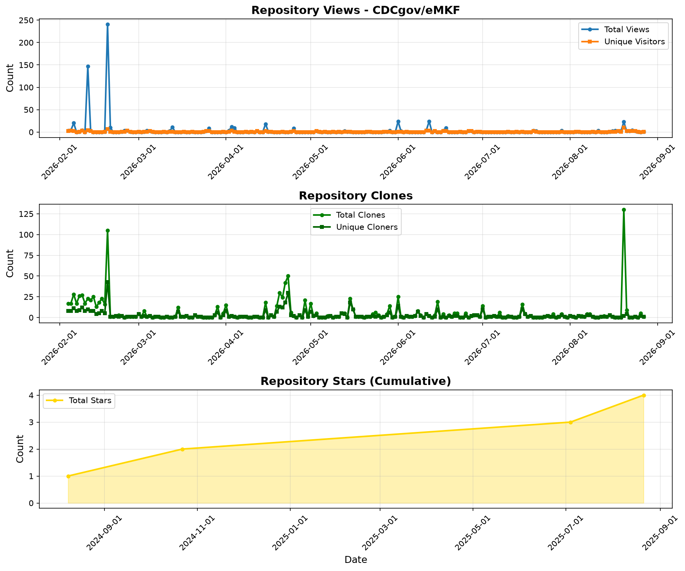

# Repository Traffic Statistics

> Last updated: **August 01, 2026 at 01:46 UTC**

## 📊 Traffic Overview

## 📈 Current Stats

### Latest 14 Days
| Metric | Total | Unique |
|--------|-------|--------|
| 👁️ **Views** | 8 | 4 |
| 📦 **Clones** | 17 | 13 |
| ⭐ **Stars** | 4 | - |

### All Time (Since Tracking Started)
| Metric | Total | Unique | Data Points |
|--------|-------|--------|-------------|
| 👁️ **Views** | 640 | 109 | 177 days |
| 📦 **Clones** | 987 | 523 | 177 days |
| ⭐ **Stars** | 4 | - | 4 days |

## 📁 Available Files

- **`traffic_plot.png`** - Visual charts (views, clones, stars)
- **`traffic_chart.txt`** - ASCII charts for terminal viewing
- **`views.json`** - Historical views data
- **`clones.json`** - Historical clones data
- **`stars.json`** - Historical stars data
- **`summary.json`** - Statistics summary

## 🔄 How This Works

This data is automatically collected every 14 days by a GitHub Action. Since GitHub only retains traffic data for 14 days, this action:
1. Fetches the current data from GitHub's API
2. Merges it with historical data
3. Builds a continuous timeline beyond the 14-day limit

Each run adds to the existing dataset, creating a complete historical record.
